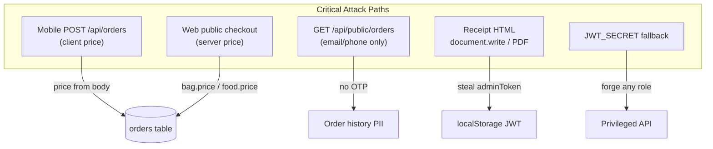

# GoodtoGo / Grabengo — Complete Code Review Report

**Scope:** Monorepo at [`/Users/macbookpro/Desktop/projects/GoodtoGo`](.)  
**Apps reviewed:** [`backend/`](backend/) (Express + PostgreSQL/SQLite), [`admin-web/`](admin-web/) (Vite/React), [`mobile-app/`](mobile-app/) (Expo/React Native)  
**Method:** Static analysis of source, cross-app auth/checkout flows, config files, and test coverage. No runtime penetration testing.

---

## Executive Summary

The codebase is a functional multi-tenant food-rescue marketplace with reasonable foundations (parameterized SQL, bcrypt passwords, RBAC policy file, tenant access guards, idempotent public checkout). However, **several critical financial and privacy vulnerabilities exist**, mostly around **trusting client-supplied data** and **unauthenticated PII endpoints**.

| Severity | Count (approx.) | Top themes |
|----------|-----------------|------------|
| CRITICAL | 5 | Price manipulation, order history leak, default JWT secret, receipt XSS |
| HIGH | 18 | No rate limiting, weak auth/session handling, open redirects, token storage |
| MEDIUM | 22 | Validation gaps, monolithic files, compliance stubs, config drift |
| LOW | 15 | Logging, dead code, version drift, docs |

**Most urgent fixes (do first):**
1. Server-side pricing on authenticated checkout ([`backend/src/index.js`](backend/src/index.js) L935–949)
2. OTP-gate or auth-gate public order lookup ([`backend/src/index.js`](backend/src/index.js) L2677–2699)
3. Remove default `JWT_SECRET` ([`backend/src/middleware.js`](backend/src/middleware.js) L4)
4. HTML-escape receipt generation ([`admin-web/src/pages/CustomerPage.jsx`](admin-web/src/pages/CustomerPage.jsx), [`mobile-app/App.js`](mobile-app/App.js))



---

## Architecture Notes (Best Practices)

| Area | Current state | Recommendation |
|------|---------------|----------------|
| Backend structure | Single ~2,700-line [`backend/src/index.js`](backend/src/index.js) | Split into route modules + shared middleware |
| Admin web | Single ~3,300-line [`admin-web/src/App.jsx`](admin-web/src/App.jsx) | Extract auth, dashboard tabs, API client |
| Mobile | Single ~6,117-line [`mobile-app/App.js`](mobile-app/App.js) + unused [`SellerDashboard.js`](mobile-app/SellerDashboard.js) | Split screens/services; delete dead code |
| API client | Duplicated `API_URL` in 5+ admin files; raw axios in mobile | One shared client with interceptors |
| Validation | Ad-hoc checks, no schema library | Zod/Joi at API boundary |
| Security middleware | `cors()` open, no helmet, no rate limit | Add helmet, rate-limit, strict CORS |
| Tests | 17 test files, **backend-heavy; zero mobile tests** | Add checkout/auth/security regression tests |

---

## CRITICAL Findings

### C1. Client-controlled order prices (financial fraud)
**Location:** [`backend/src/index.js`](backend/src/index.js) L913–957  
**Also called from:** [`mobile-app/App.js`](mobile-app/App.js) (checkout sends `price` in payload)

Authenticated mobile checkout validates stock via `previewCheckoutItems()` but **persists `item.price` from the request body**:

```935:949:backend/src/index.js
        const { id, type, quantity, price } = item;
        // ...
          const info = await db.prepare('INSERT INTO orders ... price ...').run(..., price, method);
```

Public guest checkout in the same file correctly uses **DB prices** (`bag.price`, `food.price` at L2293–2322).

**Impact:** Any customer with a modified client can order at £0.01 or any arbitrary price.  
**Fix:** Never read `price` from client. Use DB price from preview/bag/food row. Reject if client sends a mismatched price.

---

### C2. Unauthenticated order history disclosure (PII leak)
**Location:** [`backend/src/index.js`](backend/src/index.js) L2677–2699  
**Consumed by:** [`admin-web/src/pages/CustomerPage.jsx`](admin-web/src/pages/CustomerPage.jsx)

`GET /api/public/orders?email=...` or `?phone=...` returns up to 50 orders (store names, addresses, prices, pickup times) with **no OTP or session**.

**Impact:** Email/phone enumeration exposes full purchase history.  
**Fix:** Require the same OTP flow used for guest checkout, or authenticated session.

---

### C3. Default JWT secret allows token forgery
**Location:** [`backend/src/middleware.js`](backend/src/middleware.js) L4

```javascript
const JWT_SECRET = process.env.JWT_SECRET || 'super_secret_key_change_in_production';
```

**Impact:** If env var is unset in production, anyone can forge SuperAdmin tokens.  
**Fix:** Fail fast at startup when `JWT_SECRET` is missing/weak in production.

---

### C4. DOM XSS in admin-web receipt download
**Location:** [`admin-web/src/pages/CustomerPage.jsx`](admin-web/src/pages/CustomerPage.jsx) L22–123

User/API fields (`contactInfo.name`, `item_name`, `store_name`, etc.) are interpolated into HTML and written via `win.document.write(html)`.

**Impact:** Malicious store/item names or contact data execute script in receipt window. Combined with JWT in `localStorage`, this can lead to **admin session theft**.  
**Fix:** HTML-escape all dynamic values or build DOM with `textContent`. Prefer server-side PDF generation ([`backend/src/receipt.js`](backend/src/receipt.js) exists — reuse it).

---

### C5. HTML injection in mobile receipt PDF
**Location:** [`mobile-app/App.js`](mobile-app/App.js) L69–97 (`generateReceiptHTML`)

Same pattern: `${item.name}`, `${customerName}`, `${storeName}` unescaped in HTML template for `expo-print`.

**Impact:** HTML/script injection in PDF output; lower severity than web XSS but still exploitable in some viewers.  
**Fix:** Shared `escapeHtml()` utility used by web and mobile.

---

## HIGH Findings

### Backend

| ID | Issue | Location | Fix |
|----|-------|----------|-----|
| H1 | No rate limiting on login, OTP, forgot-password, contact | [`backend/src/index.js`](backend/src/index.js) | Add `express-rate-limit`; lock out after N OTP failures |
| H2 | OTP uses `Math.random()` (predictable) | L462, L2578, L2627 | Use `crypto.randomInt(100000, 999999)` |
| H3 | Password reset does not invalidate refresh tokens | L494–520 | Clear `refresh_token` on reset; consider `token_version` |
| H4 | User enumeration on forgot-password (404 vs 200) | L457–459 | Always return generic success message |
| H5 | Open CORS on all routes | L183 `app.use(cors())` | Allowlist origins from env |
| H6 | Open S3 media proxy — any key readable | [`backend/src/index.js`](backend/src/index.js) L282–291, [`backend/src/aws.js`](backend/src/aws.js) | Prefix allowlist (`uploads/`, `brand/`); prefer signed URLs |
| H7 | Base64 uploads: 10MB JSON, no magic-byte validation | [`backend/src/aws.js`](backend/src/aws.js) L69–109 | Cap decoded size; allowlist MIME; validate magic bytes |
| H8 | Inventory race on authenticated orders | [`backend/src/index.js`](backend/src/index.js) L941–948 | Use atomic `UPDATE ... WHERE quantity >= ? RETURNING *` (same as public checkout L2282+) |
| H9 | Spoofable `x-grabengo-client: mobile` header bypasses seller subdomain check | L92–94, L382–389 | Signed client credential or always require subdomain |
| H10 | PostgreSQL SSL `rejectUnauthorized: false` | [`backend/src/db.js`](backend/src/db.js) L24 | Proper CA verification in production |
| H11 | Self-service `SellersAdmin` registration without approval | [`backend/src/index.js`](backend/src/index.js) L298–349 | Admin approval or SuperAdmin-only tenant creation |
| H12 | JWT embeds role/tenant for 7 days without DB revalidation | [`backend/src/middleware.js`](backend/src/middleware.js) L16–17 | Re-fetch role on sensitive ops or shorten access token TTL |

### Admin Web

| ID | Issue | Location | Fix |
|----|-------|----------|-----|
| H13 | JWT + user object in `localStorage` (XSS → takeover) | [`admin-web/src/App.jsx`](admin-web/src/App.jsx) L83–91 | HttpOnly cookies or SecureStore pattern; strict CSP |
| H14 | `ProtectedRoute` checks token presence only, not validity/role | [`admin-web/src/components/ProtectedRoute.jsx`](admin-web/src/components/ProtectedRoute.jsx) | Wait for `/auth/me`; role-aware guard; logout on 401 |
| H15 | `/auth/me` failure silently ignored (`.catch(() => {})`) | [`admin-web/src/App.jsx`](admin-web/src/App.jsx) | Fail closed → logout |
| H16 | Open redirect after login via `location.state.from.pathname` | L503–504 | Only allow same-origin paths starting with `/` |
| H17 | Open redirect via API-controlled `storeUrl` | L169, L507–513 | Allowlist hostnames before `assign`/`href` |
| H18 | WebSocket sends raw JWT in first message | L731–738 | WSS only; short-lived WS ticket |
| H19 | Mapbox token in client bundle (`VITE_MAPBOX_TOKEN`) | `.env`, L39 | Restrict token by URL in Mapbox dashboard |

### Mobile App

| ID | Issue | Location | Fix |
|----|-------|----------|-----|
| H20 | JWT in plaintext AsyncStorage | [`mobile-app/App.js`](mobile-app/App.js) L5863–5910 | `expo-secure-store` for tokens |
| H21 | Invalid session kept when `/auth/me` fails | L5868–5877 | Logout on 401; global axios interceptor |
| H22 | Refresh token returned at login but never used | L1381+ | Implement silent refresh flow |
| H23 | Inconsistent 401 handling across screens | Discover vs Seller dashboard | Central `handleSessionExpired()` |
| H24 | Sensitive data logged (`Expo Push Token`, etc.) | Throughout `App.js` | Guard with `__DEV__` |
| H25 | Large base64 images in JSON POST bodies | Register, profile, seller uploads | Presigned S3 upload; size limits |
| H26 | `.env` not gitignored (only `.env*.local`) | [`mobile-app/.gitignore`](mobile-app/.gitignore) | Add `.env`; use EAS secrets |

---

## MEDIUM Findings

### Security & Compliance
- **M1.** No security headers (Helmet) on API — [`backend/src/index.js`](backend/src/index.js)
- **M2.** Seed routes (`/api/seed`, hardcoded `superadmin123`) gated only by `NODE_ENV` — [`backend/src/middleware.js`](backend/src/middleware.js) `blockInProduction`
- **M3.** HTML injection in admin contact email (unescaped name/subject) — [`backend/src/index.js`](backend/src/index.js) L1870+
- **M4.** `DoNotSell` form is a stub (no API) — [`admin-web/src/pages/DoNotSell.jsx`](admin-web/src/pages/DoNotSell.jsx) — CCPA compliance gap
- **M5.** Cookie policy misstates `localStorage` tokens as session cookies — [`admin-web/src/pages/CookiePolicy.jsx`](admin-web/src/pages/CookiePolicy.jsx)
- **M6.** No Content-Security-Policy on admin-web — [`admin-web/index.html`](admin-web/index.html)
- **M7.** Public seller registration with no CAPTCHA — [`admin-web/src/App.jsx`](admin-web/src/App.jsx) L534–568
- **M8.** Untrusted logo/image URLs from API in `` — multiple files
- **M9.** Dev tenant redirect `?tenant=x` without slug validation — [`admin-web/src/App.jsx`](admin-web/src/App.jsx) L109–119

### Bugs
- **M10.** SQLite `datetime()` in PostgreSQL inactivity query — [`backend/src/index.js`](backend/src/index.js) L1247–1254 (will fail on Postgres)
- **M11.** WebSocket typing indicator uses wrong client key (`sellers` vs `sellers_${tenantId}`) — L1789–1795
- **M12.** Weak phone matching (last 10 digits) — [`backend/src/phone.js`](backend/src/phone.js)
- **M13.** Unsafe `JSON.parse` without try/catch on API data — [`mobile-app/App.js`](mobile-app/App.js) multiple locations
- **M14.** Dead duplicate seller dashboard — [`mobile-app/SellerDashboard.js`](mobile-app/SellerDashboard.js) (different WS URL pattern)
- **M15.** `expo-build-properties` installed but unused in [`mobile-app/app.json`](mobile-app/app.json)

### Best Practices
- **M16.** No centralized API client / duplicated `API_URL` fallback to `localhost:3000` in production builds
- **M17.** Widespread empty `catch (err) {}` — errors swallowed in admin [`App.jsx`](admin-web/src/App.jsx)
- **M18.** No password strength / email validation on client or server consistently
- **M19.** No axios timeouts — hung requests block UI indefinitely (mobile)
- **M20.** Android deprecated storage permissions still declared — [`mobile-app/app.json`](mobile-app/app.json) L37–38
- **M21.** iOS "Always" location string declared but only foreground used — App Store rejection risk
- **M22.** Production error messages leak `err.message` to clients — [`backend/src/index.js`](backend/src/index.js) many catch blocks

---

## LOW Findings

- **L1.** Monolithic files hurt auditability (backend, admin, mobile)
- **L2.** Orphan scripts in repo: `modify_app.js`, `modify_app.cjs`, `check-logo.mjs`, duplicate `backend/package-lock 2.json`
- **L3.** Version drift: `mobile-app/package.json` `"1.0.0"` vs `app.json` `"1.0.10"`
- **L4.** Dead scaffold: `mobile-app/src/app_disabled/`, unused `app/index.tsx`
- **L5.** Deep link scheme `grabengo` declared but no `Linking` handlers
- **L6.** Verbose `console.log` in production WebSocket/chat paths (admin)
- **L7.** Third-party avatar fallback leaks user IDs — [`mobile-app/App.js`](mobile-app/App.js) L1880 (`pravatar.cc`)
- **L8.** Reviews/chat without purchase verification (business rule, not enforced)
- **L9.** `.env.example` incomplete / gitignored — onboarding risk
- **L10.** Mock S3 mode returns fake URLs when credentials absent (dev-only; ensure prod fails loudly)
- **L11.** `@react-native/gradle-plugin` patch adds upgrade maintenance burden — document in README
- **L12.** API URL shown in mobile user-facing error strings — L2015
- **L13.** Run `npm audit` on all three packages (axios 1.17.0, etc.)
- **L14.** Mobile has zero automated tests
- **L15.** Admin-web has limited route/auth tests; no CustomerPage/checkout tests

---

## Positive Observations (What's Done Well)

- **SQL injection:** Consistent parameterized queries via `db.prepare()` — no string-concatenated user SQL found
- **Password storage:** bcrypt with cost 10
- **Tenant isolation:** `assertStoreAccess`, `assertBagAccess`, `assertFoodItemAccess` on mutating routes
- **RBAC:** `requireRole` + [`backend/rbac-policy.json`](backend/rbac-policy.json) on admin CRUD
- **Public checkout:** Server-side pricing, idempotency keys, `FOR UPDATE`, atomic inventory decrement
- **React XSS (UI):** No `dangerouslySetInnerHTML` in components; chat uses `{text}` rendering
- **Test DB safety:** Blocks tests without `TEST_DATABASE_URL` in [`backend/src/db.js`](backend/src/db.js)
- **Refresh token storage:** Validated against DB on refresh endpoint
- **Brand assets:** Centralized with cache busting ([`admin-web/src/brandAssets.js`](admin-web/src/brandAssets.js), sync script)
- **Production HTTPS:** EAS profiles use `https://goodtogo-ymoe.onrender.com/api`

---

## Test Coverage Gaps

| Area | Covered | Missing |
|------|---------|---------|
| Backend auth/RBAC | Yes ([`backend/tests/auth.test.js`](backend/tests/auth.test.js), [`rbac.test.js`](backend/tests/rbac.test.js)) | Price manipulation, public orders OTP, rate limits |
| Backend checkout | Partial ([`api.test.js`](backend/tests/api.test.js)) | Authenticated `/api/orders` price enforcement |
| Admin routing/auth | Yes ([`App.routes.test.jsx`](admin-web/src/App.routes.test.jsx)) | Receipt XSS, checkout, ProtectedRoute role checks |
| Mobile | **None** | Auth bootstrap, checkout, secure storage |
| E2E | None | Full purchase flow, tenant isolation |

**Recommended new tests:**
1. `POST /api/orders` rejects client price ≠ DB price
2. `GET /api/public/orders` requires OTP (after fix)
3. Receipt HTML escaping unit tests
4. Auth bootstrap fail-closed behavior (admin + mobile)

---

## Remediation Roadmap

### Phase 1 — Immediate (0–3 days, production blockers)
1. Fix server-side pricing on `POST /api/orders`
2. Protect `/api/public/orders` with OTP
3. Require `JWT_SECRET` at startup; rotate in production
4. HTML-escape receipts (web + mobile) or use [`backend/src/receipt.js`](backend/src/receipt.js)
5. Add rate limiting + `crypto.randomInt` for OTPs

### Phase 2 — High priority (1–2 weeks)
6. Secure token storage (SecureStore mobile; evaluate HttpOnly cookies for admin)
7. Auth hardening: `/auth/me` gate, global 401 interceptors, role-aware `ProtectedRoute`
8. Fix inventory race on authenticated orders
9. Tighten CORS, S3 proxy allowlist, upload validation
10. Invalidate sessions on password reset
11. Validate login/storeUrl redirects

### Phase 3 — Hardening & quality (2–4 weeks)
12. Input validation library (Zod) on all API endpoints
13. Add Helmet + CSP headers
14. Split monolithic files; central API clients
15. Wire DoNotSell to backend; fix Cookie Policy
16. Remove dead code, align versions, add mobile tests
17. Fix Postgres `datetime()` bug in reminders query

---

## Files Requiring Most Attention

| Priority | File | Why |
|----------|------|-----|
| P0 | [`backend/src/index.js`](backend/src/index.js) | Pricing bug, public orders, auth, uploads, monolith |
| P0 | [`backend/src/middleware.js`](backend/src/middleware.js) | JWT secret, RBAC |
| P1 | [`admin-web/src/pages/CustomerPage.jsx`](admin-web/src/pages/CustomerPage.jsx) | Receipt XSS, public checkout |
| P1 | [`admin-web/src/App.jsx`](admin-web/src/App.jsx) | Auth, localStorage, redirects |
| P1 | [`mobile-app/App.js`](mobile-app/App.js) | Token storage, checkout payload, monolith |
| P2 | [`backend/src/aws.js`](backend/src/aws.js) | Upload limits, S3 proxy |
| P2 | [`backend/src/db.js`](backend/src/db.js) | SSL config |

---

## Conclusion

The application is **not production-hardened** for a payments-adjacent marketplace until **C1–C3** are fixed. The public checkout path was built securely; the authenticated mobile checkout path regressed by trusting client prices. Frontend auth patterns (localStorage/AsyncStorage JWTs, client-only route guards) are common but ** amplify any XSS impact**.

This report is read-only. Switch to **Agent mode** and reference specific finding IDs (e.g. "fix C1, C2, C4") to implement remediations in priority order.
